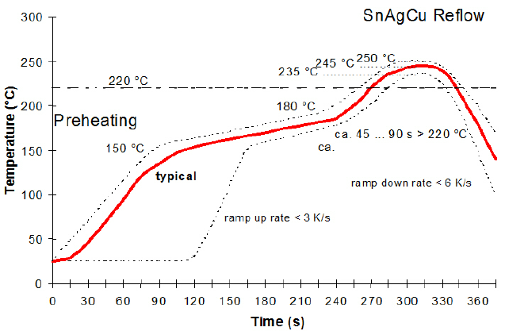

# Building the Boards

## Warning

If you haven't gotten the frame 3d printed yet, now is the time to do so.
You'll need it when you want to install the dual encoders.

## SMD Components

There are a large number of SMD components to install.  We highly recommend you
use solder paste and some combination of reflow and hot air instead of an iron.
It will save you a lot of time.

Pick a board, and start with the side that does not contain buttons. The buttons
are tiny and easily damaged by excess heat, so it's best to do them last.  We
use a pre-heater and hot air, so here's our process:

1. Lay down solder paste on all pads you intend to solder.  Don't worry if the
   paste isn't perfect or bridges.  It will fix itself when you apply heat.
2. Clamp the board on the pre-heater.
3. Lay the components down on the pads with fine tweezers.
4. Pre-heat the board to 180C.
5. Use a hot air gun at 250C to flow the solder.  Use the lowest air flow
   setting possible to avoid blowing the components around.
6. Turn off the pre-heater.

Repeat this process for the resistors and diodes on the other side.

**Pay careful attention to the polarity of the diodes.  A diode installed
backwards can be difficult to debug.  Make sure that the line on the diode is
installed on the same side as the line in the symbol on the PCB.**

## Teensy Tiny Buttons

Now you're ready to install the buttons.  These are essentially the same as
the other components, but greater care is warranted.  These buttons actually
specify that they should be installed according to this thermal profile:

We used a timer and an infrared thermometer to match that profile as well as
our equipment was able.  Our experience was that the most critical part is to
keep the time spent above 200C as short as possible.  We were unable to ramp up
to 180C as fast as the chart specified, but that didn't seem to be a problem.
We didn't have to worry about ramp down speed since the board cooled slower than
6C/s even with all heat sources removed.

If you expose a button to excess heat, it will change color from pale yellow
to a brownish yellow.  This will cause the rubber dome to be brittle and it
will probably fail prematurely.  In this case, cover the other buttons with
Kapton tape and/or aluminum foil to shield them from more heat.  Then go
through the same heating steps as before to remove the bad component and
install a new one.  We found that the buttons could withstand several cycles
up to 180C without damage, but additional cycles to temperatures above 200C
caused problems.

## Pin Headers and Connectors

Install the pin headers and IDC connectors using a soldering iron.

## Caution

It's wise to do the encoder installs in stages because a mistake can cause
very odd errors that are hard to debug.  Start with a single encoder on the left
side.  Install the Arduino and make sure that encoder produces the expected
output on the serial port.  Then install another encoder and test.  After that,
connect the bottom board and test.  Finally connect the right board and install
those encoders one by one.

## Dual Encoders

The dual encoders stick through the holes in the PCB and are soldered to the
other side.  The thru-holes in the PCB are positioned so that they are offset
from the encoder pins by 2.54mm, which is the standard spacing for perfboard.

Buy some strip board and cut out 10 2x5 pieces.  The strips must run
along the short dimension so that you have 5 circuits with two holes each. The
easiest way to cut it is to clamp the boards in a vise with the lip of the
vise aligned with the cut you want to make.  Run a razor blade along the lip
of the vise 3 times on each side.  Then flex the board back and forth until it
breaks.

**Do not proceed further unless you have the 3d printed frame in hand!**

Place the dual encoders in the frame.  Refer to the pin labels on the back of
the encoders and the text on the PCB to make sure that the encoders are
installed right side up.  Once all the encoders are oriented correctly, place
the PCB in its slot in the frame.  Place a strip board on either side of an
encoder so that the encoder pins are connected to the pin headers on the PCB.
Securely fasten the encoder to the frame using the included nut.  Now you can
solder the pins to the perf board.  This procedure is necessary to make sure
the encoder sits at the correct height off of the PCB.

## Single Encoders

Solder the single encoders in place.  No special care is needed other than
making sure they sit flush on the PCB.

## Ribbon cables

TODO: Add notes here about the correct orientation.

## Joystick cable

TODO: Add notes about how to install the header on the joystick cable.

## Arduino Install

Solder the pin headers to the Arduino.  It's important to make sure they are
exactly vertical so it will fit in the socket on the board.  We recommend
putting the headers in a breadbord while soldering them to make sure they are
correct.

Install the Arduino on the left side PCB with the USB port facing down.

## Testing

Spin the encoders and push buttons while watching the serial console.  Make
sure you see all the events you expect and none that you don't.  If you
installed a diode backward, you may find that you will get spurious events
only when a certain encoder is in a certain position.  Thoroughly test each
encoder and its nearby components after you install each one.
